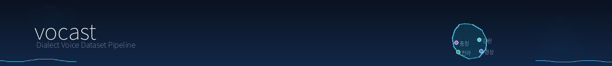
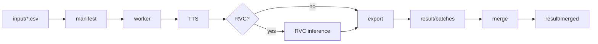

<p align="center">
  
</p>

<p align="center">
  <a href="https://github.com/sukoji/vocast/actions/workflows/ci.yml"></a>
  
  
  
  
</p>

<p align="center">
  <strong>방언 민원 대화 → Typecast TTS → (선택) RVC → 4도 통합 음성 데이터셋</strong><br/>
  강원 · 경상 · 전라 · 충청 권역의 악취 민원 시나리오를 표준 zip 포맷으로 합성하는 end-to-end 파이프라인
</p>

---

## Overview

**vocast**는 CSV 시나리오를 입력으로 받아, 권역별 Typecast TTS 규칙에 따라 민원인·상담원 대화 음성을 생성하고, 필요 시 RVC로 민원인 턴만 변환한 뒤 **`4도_통합_음성민원데이터`** 포맷으로 내보냅니다.



| 기능 | 설명 |
|------|------|
| **다중 worker** | `batch_id` + `job_id`(UUID)로 병렬 실행·merge 안전 |
| **권역 규칙** | `config/region_rules.yaml` — zip 샘플과 동일 voice·감정·강도·tempo |
| **metadata** | `metadata.csv` 17컬럼 zip 호환 (`uid`, `turn_index=full` 행 포함) |
| **RVC** | 적응형 pitch, 모델 registry, blend, 학습 파이프라인 내장 |
| **제주도** | 자동 스킵 |

---

## Repository layout

```text
vocast/
├── input/              # 시나리오 CSV
├── config/
│   ├── region_rules.yaml   # 권역별 TTS 규칙
│   ├── voices.yaml         # Typecast voice_name → voice_id
│   ├── pipeline.yaml       # variants, adaptive pitch
│   ├── train_targets.yaml  # RVC 학습 타깃
│   └── 룰.txt
├── models/
│   ├── models.yaml     # RVC 모델 + blend registry
│   └── weights/        # .pth / .index (gitignore)
├── scripts/            # CLI 진입점
├── src/vocast/         # 핵심 라이브러리
├── rvc_stack/          # RVC 학습 스택 (symlink)
├── result/
│   ├── batches/        # worker별 격리 출력
│   └── merged/         # merge_batches.py 결과
├── work/               # manifest, 임시 TTS (gitignore)
└── tests/              # CI smoke tests
```

---

## ID & seed policy

| 키 | 역할 | 노출 위치 |
|----|------|-----------|
| `job_id` | UUID — worker·manifest 내부 추적 | manifest / `work/` |
| `batch_id` | worker 실행 단위 | `result/batches/{batch_id}/` |
| `variant_id` | `tts_only` / `rvc_*` | 폴더 suffix (`__rvc-*`) |
| `uid` | `{권역}_id{scenario_id}` | **metadata.csv** (zip 포맷) |
| `source_uid` | CSV 원본 UUID (있을 경우) | manifest only |
| `param_seed` | `scenario_id` 기반 — TTS 파라미터 재현 | manifest |

- **민원인** emotion / intensity / tempo: `param_seed` 하나의 RNG에서 순서대로 결정
- **상담원** voice: `param_seed × 7919` 독립 시드 — 감정·강도와 분리
- merge: `(uid, turn_index, file)` 기준 dedupe

---

## Quick start

### 1. Setup

```bash
cd vocast
cp .env.example .env          # TYPECAST_API_KEY
pip install -e .

# (선택) dialect 프로젝트 .env 자동 로드
# src/vocast/env.py → ../dialect/llm_dialect_test/.env
```

### 2. Build manifest

```bash
# 전체 시나리오 × variants (제주 제외)
python scripts/build_manifest.py \
  --csv input/20260701_sample.csv \
  --batch-id run01

# 테스트: 권역당 3개, TTS only
python scripts/build_manifest.py \
  --csv input/comparison_20260702_160452.csv \
  --batch-id test_run \
  --per-region 3 \
  --variants tts_only
```

### 3. Shard & run workers

```bash
# 4 worker 분배 예시
python scripts/build_manifest.py --batch-id run01 --shard 0 --shard-count 4
python scripts/build_manifest.py --batch-id run01 --shard 1 --shard-count 4

# GPU node (RVC jobs)
python scripts/run_worker.py --manifest work/manifest_run01_shard000of004.jsonl
```

### 4. Merge & rebuild metadata

```bash
python scripts/merge_batches.py
# → result/merged/4도_통합_음성민원데이터/

# batch metadata 재생성 (zip 포맷 맞춤)
python scripts/rebuild_metadata.py \
  --batch-id test_run \
  --manifest work/manifest_test_run.jsonl
```

---

## Output format

`result/merged/4도_통합_음성민원데이터/` — [`4도_통합_음성민원데이터_개선_샘플.zip`](https://github.com/sukoji/vocast)과 동일 구조:

```text
4도_통합_음성민원데이터/
├── metadata.csv          # 17 columns, zip-compatible
├── 룰.txt
└── {권역}/
    └── {권역}_id{N}_min-{voice}_{emo}_i0.70_tempo1.00_sang-{counselor}/
        ├── t01_sang-*.wav
        ├── t02_min_*.wav
        └── full__min_*.wav
```

**metadata.csv 규칙**

- 턴 행: location/smell 컬럼 비움
- `turn_index=full` 행: 시나리오 meta 채움, speaker/voice 비움
- `uid` = `강원도_id10` 형식 (CSV UUID 아님)
- 파일 경로 숫자: `i0.70`, `tempo1.00` (소수점 2자리)

RVC variant 폴더: zip 호환 이름 + `__{variant_id}` suffix

---

## TTS rules

`config/region_rules.yaml` + `config/룰.txt`

| 권역 | 민원인 | 상담원 |
|------|--------|--------|
| 강원도 | Cheolyong | 공통 counselor pool |
| 경상도 | Yoonseo | 공통 counselor pool |
| 전라도 | Seohee (happy 고정) | 공통 counselor pool |
| 충청도 | Changsu | 공통 counselor pool |

상담원 voice pool: Seohyeon, Daeun, Seungjae, Kangil, Skylar, Cheolhoon, Youngmok, Moonjung, Minuk, Leehyun, Hyoeun, Wonwoo, Seojin

---

## RVC inference

`config/pipeline.yaml` → `variants`:

```yaml
variants:
  - id: tts_only
    rvc: false
  - id: rvc_seohyeon
    rvc: true
    model: typecast_seohyeon
  - id: rvc_jihoon
    rvc: true
    model: typecast_jihoon
```

- **민원인 턴만** RVC 변환 (상담원 TTS 그대로)
- 적응형 pitch: PyWorld F0 → semitone shift → `models/models.yaml` registry
- TTS 중간 파일은 `work/{job_id}/`에만 임시 저장

---

## RVC training

`rvc_train/` (~26GB)은 Git 미포함. 서버 symlink:

```bash
bash scripts/setup_rvc_stack.sh
export VOCAST_CORPUS_DATASET=~/dialect/llm_dialect_test/audio_dataset  # optional
```

| 단계 | 명령 |
|------|------|
| 코퍼스 TTS | `python scripts/synth_corpus.py --target typecast_seohyeon` |
| 학습 (GPU) | `python scripts/train_rvc.py --target typecast_seohyeon` |
| 일괄 | `bash scripts/train_pipeline.sh typecast_seohyeon` |
| Slurm | `sbatch scripts/sbatch/train_rvc.sbatch typecast_jihoon` |

산출: `models/weights/{name}/` + `models/models.yaml` 자동 등록

```bash
python -m vocast.rvc.blend models/weights/a.pth models/weights/b.pth \
  --alpha 0.5 --out models/weights/blends/out.pth
```

자세한 스택: [`rvc_stack/README.md`](rvc_stack/README.md)

---

## Slurm example

```bash
BATCH=run01
SHARD=$SLURM_ARRAY_TASK_ID
COUNT=100

python scripts/build_manifest.py \
  --batch-id $BATCH --shard $SHARD --shard-count $COUNT

python scripts/run_worker.py \
  --manifest work/manifest_${BATCH}_shard$(printf '%03d' $SHARD)of$(printf '%03d' $COUNT).jsonl
```

---

## Development

```bash
pip install pytest pyyaml
PYTHONPATH=src pytest -q tests/
```

변경은 **`main`에 직접 push하지 않고** PR로 merge합니다. CI 통과 시 auto-merge.

- CI: [`.github/workflows/ci.yml`](.github/workflows/ci.yml)
- PR automation: [`.github/workflows/pr-automation.yml`](.github/workflows/pr-automation.yml)
- 설정 가이드: [`docs/GITHUB_AUTOMATION.md`](docs/GITHUB_AUTOMATION.md)

---

## License

Internal research / dataset pipeline. Typecast API key required for TTS synthesis.
